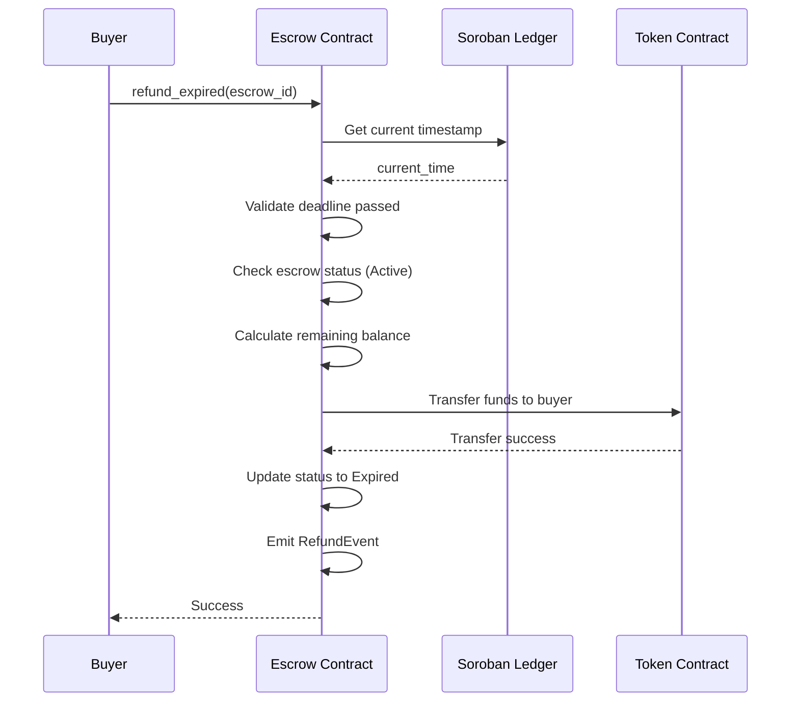

# Design Document: Escrow Time-Lock Refund

## Overview

This design implements a time-lock mechanism with automatic refund functionality for the Vaultix escrow smart contract on Soroban/Stellar. The feature enables buyers to reclaim their funds when an escrow deadline expires without seller action, providing protection against unresponsive counterparties while maintaining compatibility with existing dispute resolution and milestone release mechanisms.

The implementation adds a new `refund_expired` function that validates deadline expiration, checks escrow eligibility, transfers remaining funds to the buyer, and updates the escrow status. The design integrates seamlessly with the existing escrow lifecycle and preserves all security guarantees.

## Architecture

### High-Level Flow



### Integration Points

The time-lock refund mechanism integrates with existing contract components:

1. **Escrow Storage**: Uses the existing `Escrow` struct with the `deadline` field
2. **Status Management**: Adds a new terminal status (Expired or Refunded) to the existing status enum
3. **Token Transfers**: Leverages the existing token transfer mechanisms
4. **Event System**: Extends the event emission system with a new RefundEvent
5. **Fee System**: Integrates with the existing platform fee calculation (BPS-based)

## Components and Interfaces

### New Status Enum Value

Add a new terminal status to the existing escrow status enum:

```rust
pub enum EscrowStatus {
    Created,
    Active,
    Completed,
    Cancelled,
    Disputed,
    Resolved,
    Expired,  // New status for expired refunds
}
```

### Refund Function Signature

```rust
pub fn refund_expired(
    env: Env,
    escrow_id: u64
) -> Result<(), ContractError>
```

**Parameters:**
- `env`: Soroban environment providing access to ledger, storage, and token operations
- `escrow_id`: Unique identifier for the escrow to refund

**Returns:**
- `Ok(())` on successful refund
- `Err(ContractError)` with specific error variant on failure

### Error Types

Extend the existing `ContractError` enum with new variants:

```rust
pub enum ContractError {
    // ... existing errors ...
    DeadlineNotReached,      // Attempted refund before deadline
    InvalidStatusForRefund,  // Escrow not in Active status
    NoFundsToRefund,        // All funds already released
    Unauthorized,           // Caller not authorized for refund
}
```

### Event Structure

Define a new event for refund operations:

```rust
pub struct RefundEvent {
    pub escrow_id: u64,
    pub buyer: Address,
    pub amount: i128,
    pub timestamp: u64,
}
```

## Data Models

### Escrow Struct (Existing)

The existing `Escrow` struct already contains the necessary fields:

```rust
pub struct Escrow {
    pub id: u64,
    pub depositor: Address,      // Buyer
    pub beneficiary: Address,    // Seller
    pub amount: i128,
    pub released_amount: i128,
    pub deadline: u64,           // Used for expiration check
    pub status: EscrowStatus,
    pub token: Address,
    // ... other fields ...
}
```

**Key Fields for Refund:**
- `deadline`: Compared against ledger timestamp
- `status`: Must be Active for refund eligibility
- `amount`: Original deposit amount
- `released_amount`: Tracks partial milestone releases
- `depositor`: Recipient of refunded funds

### Storage Keys

The implementation uses existing storage patterns:

```rust
// Escrow data stored with persistent storage
const ESCROW: Symbol = symbol_short!("ESCROW");

// Storage key: (ESCROW, escrow_id) -> Escrow
```

## Implementation Details

### Refund Validation Logic

The `refund_expired` function follows this validation sequence:

1. **Escrow Existence**: Verify escrow exists in storage
2. **Deadline Check**: `env.ledger().timestamp() > escrow.deadline`
3. **Status Validation**: `escrow.status == EscrowStatus::Active`
4. **Balance Check**: `(escrow.amount - escrow.released_amount) > 0`
5. **Authorization**: Verify caller is authorized (buyer or permissionless)

### Fund Calculation

Calculate refundable amount accounting for partial releases:

```rust
let remaining_balance = escrow.amount - escrow.released_amount;
let platform_fee = calculate_fee(remaining_balance, fee_bps);
let refund_amount = remaining_balance - platform_fee;
```

**Fee Policy Decision Point**: The design allows for two approaches:
- **Option A**: Charge platform fee on expired refunds (incentivizes timely completion)
- **Option B**: No fee on expired refunds (buyer-friendly, not seller's fault)

The implementation should make this configurable or follow platform policy.

### Transfer Execution

Execute fund transfers using Soroban token client:

```rust
// Transfer refund to buyer
token_client.transfer(&contract_address, &escrow.depositor, &refund_amount);

// Transfer fee to platform (if applicable)
if platform_fee > 0 {
    token_client.transfer(&contract_address, &fee_recipient, &platform_fee);
}
```

### State Update

Update escrow state atomically:

```rust
escrow.status = EscrowStatus::Expired;
escrow.released_amount = escrow.amount;  // Mark all funds as released
storage.set(&(ESCROW, escrow_id), &escrow);
storage.extend_ttl(&(ESCROW, escrow_id), TTL_THRESHOLD, TTL_EXTEND);
```

### Event Emission

Emit event for off-chain tracking:

```rust
env.events().publish(
    (symbol_short!("refund"), escrow_id),
    RefundEvent {
        escrow_id,
        buyer: escrow.depositor.clone(),
        amount: refund_amount,
        timestamp: env.ledger().timestamp(),
    }
);
```

## Correctness Properties

*A property is a characteristic or behavior that should hold true across all valid executions of a system—essentially, a formal statement about what the system should do. Properties serve as the bridge between human-readable specifications and machine-verifiable correctness guarantees.*


### Property Reflection

After analyzing all acceptance criteria, I identified the following redundancies:

**Redundant Properties to Consolidate:**

1. **Deadline validation (1.2, 1.3, 8.1)**: All three criteria test the same behavior - refunds only succeed when deadline has passed. These can be combined into one comprehensive property.

2. **Status validation (2.1, 2.2, 2.3, 2.4, 2.5, 8.2)**: All six criteria test that only Active escrows can be refunded. The specific status checks (Disputed, Completed, Cancelled) are just examples of the general rule. Combine into one property.

3. **Authorization (7.1, 7.2, 7.4, 8.4)**: All test authorization logic - that buyers can refund and unauthorized callers cannot. Combine into one property.

4. **Refund amount calculation (3.2, 3.3, 4.3)**: All three test that the refund amount is correctly calculated as (remaining - fees). Combine into one comprehensive property.

5. **Event emission (6.1, 6.2, 6.3, 6.4, 6.5)**: All five criteria test event emission and structure. Combine into one property that validates the complete event.

6. **Status update (5.1, 5.3)**: Both test that status changes to Expired after refund. Combine into one property.

**Unique Properties to Keep:**

- Property for deadline validation (consolidates 1.2, 1.3, 8.1)
- Property for status validation (consolidates 2.1, 2.2, 2.3, 2.4, 2.5, 8.2)
- Property for authorization (consolidates 7.1, 7.2, 7.4, 8.4)
- Property for refund amount calculation (consolidates 3.2, 3.3, 4.3)
- Property for balance zeroing after refund (3.5)
- Property for fee calculation (4.2)
- Property for fee recipient transfer (4.4)
- Property for status update (consolidates 5.1, 5.3)
- Property for event emission (consolidates 6.1-6.5)
- Property for non-existent escrow handling (8.3)

### Properties

Property 1: Deadline Expiration Enforcement
*For any* escrow and current timestamp, a refund operation should only succeed when the current timestamp is strictly greater than the escrow's deadline, and should fail with DeadlineNotReached error otherwise.
**Validates: Requirements 1.2, 1.3, 8.1**

Property 2: Active Status Requirement
*For any* escrow, a refund operation should only succeed when the escrow status is Active, and should fail with InvalidStatusForRefund error for any other status (Disputed, Completed, Cancelled, Created, Resolved).
**Validates: Requirements 2.1, 2.2, 2.3, 2.4, 2.5, 8.2**

Property 3: Buyer Authorization
*For any* escrow, the refund operation should succeed when called by the buyer (depositor) after deadline expiration on an Active escrow, and should fail with Unauthorized error when called by any address other than the buyer (unless permissionless refunds are enabled).
**Validates: Requirements 7.1, 7.2, 7.4, 8.4**

Property 4: Refund Amount Calculation
*For any* escrow with remaining balance, the amount transferred to the buyer should equal (original_amount - released_amount - platform_fee), correctly accounting for partial milestone releases and fee deductions.
**Validates: Requirements 3.2, 3.3, 4.3**

Property 5: Balance Zeroing
*For any* escrow, after a successful refund operation, the escrow's remaining available balance should be zero (released_amount should equal original amount).
**Validates: Requirements 3.5**

Property 6: Fee Calculation Accuracy
*For any* refund amount and fee basis points (BPS), if platform fees are charged, the calculated fee should equal (refund_amount * fee_bps) / 10000, following the standard BPS calculation formula.
**Validates: Requirements 4.2**

Property 7: Fee Recipient Transfer
*For any* escrow refund where platform fees are charged, the fee recipient's balance should increase by exactly the calculated platform fee amount.
**Validates: Requirements 4.4**

Property 8: Status Update to Expired
*For any* escrow, after a successful refund operation, the escrow status should be updated to Expired and this change should persist in storage.
**Validates: Requirements 5.1, 5.3**

Property 9: Refund Event Emission
*For any* successful refund operation, a RefundEvent should be emitted containing the correct escrow_id, buyer address, refunded amount, and timestamp.
**Validates: Requirements 6.1, 6.2, 6.3, 6.4, 6.5**

Property 10: Non-Existent Escrow Handling
*For any* escrow ID that does not exist in storage, calling refund_expired should fail with an appropriate error indicating the escrow was not found.
**Validates: Requirements 8.3**

## Error Handling

The refund mechanism implements comprehensive error handling for all failure scenarios:

### Error Categories

1. **Validation Errors**:
   - `DeadlineNotReached`: Returned when current time ≤ deadline
   - `InvalidStatusForRefund`: Returned when escrow status is not Active
   - `NoFundsToRefund`: Returned when remaining balance is zero
   - `EscrowNotFound`: Returned when escrow ID doesn't exist

2. **Authorization Errors**:
   - `Unauthorized`: Returned when caller is not the buyer (unless permissionless)

3. **Transfer Errors**:
   - Token transfer failures propagate from the token contract
   - Contract maintains state consistency on transfer failures

### Error Handling Strategy

All validation checks occur before any state modifications:

```rust
// Validation phase (no state changes)
1. Check escrow exists
2. Check deadline passed
3. Check status is Active
4. Check remaining balance > 0
5. Check caller authorization

// Execution phase (state changes)
6. Calculate amounts
7. Execute transfers
8. Update escrow state
9. Emit events
```

This ordering ensures that if any validation fails, the contract state remains unchanged.

## Testing Strategy

The implementation requires both unit tests and property-based tests for comprehensive coverage.

### Property-Based Testing

Property-based tests validate universal correctness properties across all possible inputs using the `quickcheck` crate for Rust. Each property test should:

- Run minimum 100 iterations with randomized inputs
- Reference the design document property number
- Use tag format: **Feature: escrow-time-lock-refund, Property N: [property text]**

**Property Test Configuration:**

```rust
#[quickcheck]
fn property_deadline_enforcement(escrow_amount: u64, deadline: u64, current_time: u64) -> TestResult {
    // Feature: escrow-time-lock-refund, Property 1: Deadline Expiration Enforcement
    // Test implementation
}
```

**Key Property Tests:**

1. Deadline enforcement across all time combinations
2. Status validation across all status values
3. Authorization across different caller addresses
4. Refund amount calculation with various partial releases
5. Balance state after refunds
6. Fee calculations with various BPS values
7. Event emission validation
8. Error handling for invalid inputs

### Unit Testing

Unit tests focus on specific examples, edge cases, and integration scenarios:

**Core Functionality Tests:**
- Successful refund after deadline with no partial releases
- Successful refund after deadline with partial releases
- Refund rejection before deadline
- Refund rejection for non-Active statuses

**Edge Cases:**
- Zero remaining balance (all funds released)
- Maximum deadline value (u64::MAX)
- Minimum refund amounts
- Fee calculation edge cases (zero fees, maximum fees)

**Integration Tests:**
- End-to-end escrow lifecycle with expiration
- Multiple escrows with different deadlines
- Interaction with dispute mechanism
- Token transfer integration

**Mock Ledger Time:**

Tests use Soroban's test environment to control ledger time:

```rust
#[test]
fn test_refund_after_deadline() {
    let env = Env::default();
    
    // Set initial time
    env.ledger().set_timestamp(1000);
    
    // Create escrow with deadline 2000
    let escrow_id = create_escrow(&env, deadline: 2000);
    
    // Fast-forward past deadline
    env.ledger().set_timestamp(2001);
    
    // Refund should succeed
    let result = refund_expired(&env, escrow_id);
    assert!(result.is_ok());
}
```

### Test Coverage Goals

- 100% coverage of all error paths
- All 10 correctness properties validated by property tests
- All edge cases covered by unit tests
- Integration tests for cross-component interactions

### Testing Tools

- **Soroban SDK Test Utilities**: For contract testing environment
- **quickcheck**: For property-based testing in Rust
- **Mock Ledger**: For time manipulation in tests
- **Token Test Client**: For verifying token transfers

## Security Considerations

### Access Control

The refund mechanism implements authorization checks to prevent unauthorized fund access:

- Only the buyer can trigger refunds (or any address if permissionless mode enabled)
- Authorization check occurs before any state modifications
- Failed authorization returns clear error without revealing escrow details

### Reentrancy Protection

Soroban's execution model provides inherent reentrancy protection:

- All state changes are atomic within a transaction
- External calls (token transfers) cannot reenter the contract
- No additional reentrancy guards needed

### State Consistency

The implementation ensures state consistency through:

- Validation-before-modification pattern
- Atomic state updates
- Balance tracking that prevents double-refunds
- Status transitions that prevent repeated refunds

### Time Manipulation Resistance

The design uses blockchain timestamp which cannot be manipulated by users:

- `env.ledger().timestamp()` provides trusted time source
- Validators control timestamp (within consensus bounds)
- Deadline comparison uses strict inequality (>) to prevent edge cases

### Fee Handling

Platform fee handling includes safeguards:

- Fee calculation uses checked arithmetic to prevent overflow
- Fee deduction occurs before transfer to prevent underpayment
- Fee recipient address should be validated during contract initialization

## Performance Considerations

### Storage Access Patterns

The refund operation requires minimal storage access:

- Single read: Load escrow data
- Single write: Update escrow status and balance
- TTL extension: Extend storage lifetime

### Gas Optimization

The implementation optimizes gas usage through:

- Early validation failures (fail fast)
- Single storage read/write cycle
- Minimal computation (simple arithmetic)
- Efficient event emission

### Scalability

The design scales well with escrow volume:

- O(1) complexity for refund operations
- No iteration over collections
- Independent escrow processing
- No global state dependencies

## Future Enhancements

Potential future improvements to the time-lock mechanism:

1. **Grace Period**: Add configurable grace period after deadline before refunds allowed
2. **Partial Refunds**: Allow buyers to claim partial refunds for unreleased milestones
3. **Automatic Refunds**: Implement keeper/bot system to automatically process expired refunds
4. **Deadline Extension**: Allow mutual agreement to extend deadlines
5. **Refund Notifications**: Emit events when escrows approach expiration
6. **Fee Tiers**: Implement variable fee rates based on escrow duration or amount
7. **Permissionless Mode**: Make refund triggering permissionless after extended period

## Migration and Deployment

### Contract Upgrade Path

If deploying to existing contract:

1. Add new `Expired` status to enum
2. Deploy updated contract code
3. Existing escrows remain compatible (no data migration needed)
4. New refund function available immediately

### Backward Compatibility

The implementation maintains backward compatibility:

- Existing escrow data structure unchanged (deadline field already exists)
- New status value doesn't affect existing status checks
- Existing functions continue working unchanged
- No breaking changes to public API

### Deployment Checklist

- [ ] Configure platform fee policy for refunds
- [ ] Set fee recipient address
- [ ] Configure authorization mode (buyer-only vs permissionless)
- [ ] Deploy contract update
- [ ] Verify refund function in testnet
- [ ] Monitor first refund operations
- [ ] Document refund process for users
